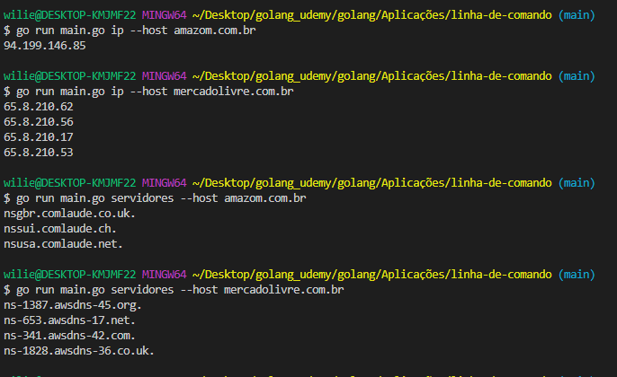

# Command_Line_Application
Uma aplicação de linha de comando, que permitira a busca de um IP e um servidor publico, atraves de uma dependencia externa github.com/urfave/cli.

Para utilizar a busca de IP's publicos é necessario passar os parametros para flag "ip" --host "link". 
Exemplo: go run main.go ip --host mercadolivre.com.br

Para utilizar a busca de Servidores publicos é necessario passar os parametros para a flag "servidores" --host "link" 
Exemplo: go run main.go servidores --host mercadolivre.com.br

 
